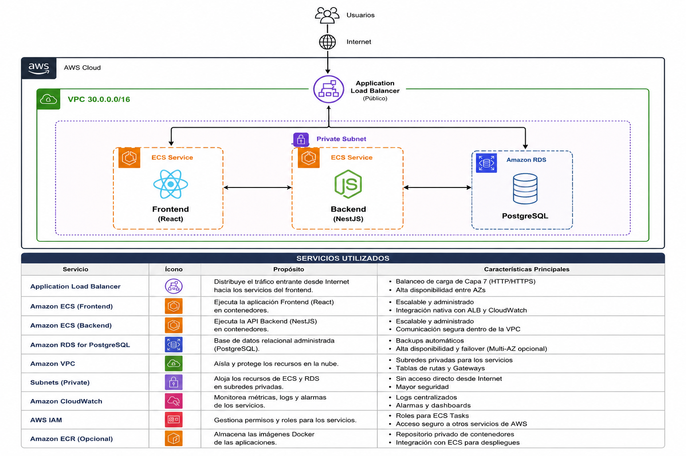

# Arquitectura en AWS (objetivo de despliegue)

No hay infraestructura de AWS desplegada todavía — este documento describe el diseño objetivo para llevar el proyecto a producción, usando **ECS Fargate** como motor de cómputo tanto del backend como del frontend.

## Diagrama de componentes

El único componente con exposición pública es el **Application Load Balancer**. Todo lo demás — las dos tareas de ECS Fargate (frontend y backend) y la instancia de RDS — vive en subnets privadas de la VPC, sin IP pública asignable. Esto es distinto de un diseño "S3 + CloudFront para el frontend": aquí el frontend también corre como contenedor (React servido por nginx) detrás del mismo ALB, lo que simplifica el modelo a "todo pasa por el ALB, todo vive en la subnet privada" a costa de perder el CDN gratuito que da CloudFront — trade-off asumido explícitamente para mantener una única puerta de entrada y un único patrón de despliegue (Docker + ECS) para los dos servicios.

## Cómo enruta el ALB

Un solo Application Load Balancer con dos **listener rules** sobre el puerto 443 (HTTPS, certificado de ACM), enrutando por **path**:

| Regla | Path             | Target group                                           |
| ----- | ---------------- | ------------------------------------------------------ |
| 1     | `/api/*`       | `tg-backend` → tareas ECS del backend (puerto 3000) |
| 2     | `/*` (default) | `tg-frontend` → tareas ECS del frontend (puerto 80) |

Es el mismo contrato que ya existe en local con `docker-compose.yml` + nginx (el frontend reenvía `/api/*` al backend) — en AWS esa responsabilidad de enrutamiento la asume el ALB directamente, así que la imagen de nginx del frontend en producción no necesita su bloque `location /api/` de reverse proxy; alcanza con servir los archivos estáticos.

## Componentes y su porqué

**ECS Fargate para ambos servicios**, no EC2 ni Lambda:

- **Vs. EC2**: Fargate elimina la gestión de instancias, parches de SO y capacity planning manual — se paga por vCPU/memoria de la tarea, no por una instancia completa infrautilizada. Para un equipo de soporte con tráfico predecible no se justifica la complejidad operativa de EC2 + Auto Scaling Groups + AMIs propias.
- **Vs. Lambda**: NestJS con conexiones persistentes a Postgres (vía Prisma) y JWT con refresh tokens no encaja bien en el modelo de ejecución de Lambda (cold starts, límite de tiempo de ejecución, pool de conexiones a DB por invocación). Fargate mantiene el proceso Node corriendo, con el pool de conexiones de Prisma reutilizado entre requests.
- **Vs. EKS**: Kubernetes es más flexible pero exige gestionar un control plane, RBAC de K8s, Helm charts — sobre-ingeniería para dos servicios. Fargate da el mismo aislamiento por contenedor con una superficie de operación mucho menor.
- **Frontend como contenedor en vez de S3 + CloudFront**: es la variante más simple operativamente (un solo tipo de despliegue — imagen Docker a ECS — para los dos servicios, un solo lugar para ver logs de ambos en CloudWatch), a cambio de perder el cacheo en el borde y el costo marginal casi nulo que da CloudFront para contenido estático. Para el volumen de tráfico esperado en esta prueba, esa pérdida de eficiencia es aceptable; si el tráfico creciera mucho, migrar el frontend a S3 + CloudFront sería la siguiente optimización natural (ver `mejoras.md`).

**Base de datos → RDS PostgreSQL (Multi-AZ)**, reemplazando el `docker-compose.yml` de desarrollo. Backups automáticos, failover administrado, parches de seguridad aplicados por AWS. Multi-AZ se recomienda desde el día uno para un sistema que registra el estado operativo real del soporte al cliente — perder la base de datos por una zona de disponibilidad caída no es aceptable.

**Red**: una única VPC (`30.0.0.0/16`) con:

- **Subnet pública**: solo el ALB (y, si se necesitara salida a internet desde la subnet privada, un NAT Gateway).
- **Subnet privada**: las tareas de ECS Fargate (frontend y backend) y RDS — ninguna tiene IP pública. El backend solo es alcanzable desde el ALB (security group del backend permite entrada únicamente desde el security group del ALB, puerto 3000); RDS solo es alcanzable desde el backend (security group de RDS permite entrada únicamente desde el security group del backend, puerto 5432).

**Secretos**: `DATABASE_URL`, `JWT_ACCESS_SECRET`, `JWT_REFRESH_SECRET` en **Secrets Manager**, inyectados como variables de entorno de la task definition de ECS — nunca horneados en la imagen Docker ni en variables de entorno planas de la consola (a diferencia de los secretos de demo hardcodeados en `docker-compose.yml`, que existen solo para que el stack local levante con un comando y están marcados explícitamente como no aptos para producción).

**Imágenes e integración continua**: cada push a `main` dispara un workflow de GitHub Actions que hace `docker build` de la imagen que cambió (frontend y/o backend), la publica en **ECR**, y actualiza la task definition de ECS correspondiente (`aws ecs update-service --force-new-deployment`). Es la misma estructura de Dockerfile multi-stage que ya se usa en local — el artefacto que se prueba localmente con `docker compose up --build` es, en esencia, el mismo que se despliega.

**Auto-scaling**: cada servicio de ECS (frontend y backend) escala de forma independiente entre 2 y 6 tareas según CPU/memoria promedio (target tracking), con un mínimo de 2 tareas para tolerar el reinicio de una tarea sin caída de servicio. El ALB hace health-check contra `GET /api` para el backend y `GET /` para el frontend.

**Observabilidad**: logs de ambos servicios de Fargate van a **CloudWatch Logs** (driver `awslogs`, nativo de ECS); alarmas sobre CPU/memoria alta, tasa de errores 5xx del ALB, y espacio de almacenamiento de RDS.

**Migraciones y seed en despliegue**: `prisma migrate deploy` corre como parte del arranque de la tarea del backend (mismo `docker-entrypoint.sh` que en local) — no como un job separado. Es aceptable para el volumen de cambios de este proyecto; si el equipo creciera, el siguiente paso sería moverlo a un paso explícito del pipeline de CI antes del despliegue (evita que dos tareas del backend arrancando en paralelo compitan por correr la misma migración). El **seed** de datos de prueba (`prisma db seed`) se ejecuta solo en el entorno local vía Docker Compose — en el pipeline hacia AWS ese paso se omite deliberadamente, porque un entorno de producción no debe poblarse con clientes y tickets ficticios.

## Qué se dejó fuera deliberadamente (alcance de esta prueba)

- **WAF** delante del ALB — recomendado en producción real, no crítico para defender la arquitectura de esta prueba.
- **Múltiples entornos (staging/prod) con cuentas AWS separadas** — el paso natural siguiente, no necesario para el alcance actual.
- **Blue/green deployments** — ECS soporta despliegues con CodeDeploy, pero un rolling update estándar de ECS ya cubre el caso de uso sin la complejidad adicional de un segundo target group por servicio.
- **CDN (CloudFront) para el frontend** — descartado a favor de simplicidad operativa, según se explicó arriba; queda documentado como mejora futura, no como omisión.
